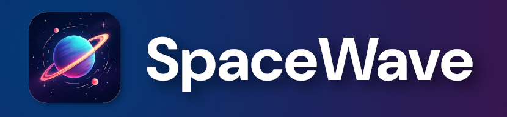

<div align="center">
  <a href="https://spacewave.app" target="_blank" rel="noopener noreferrer">
    
  </a>

  <h3>Lightning-fast local-first workspaces with peer-to-peer sync</h3>

  <p>
    Combining the flexibility of cloud apps with the freedom of open-source.<br/>
    Full-stack for plugins and apps with Go, TypeScript, React, WebAssembly.<br/>
  </p>

  <p>
    <a href="https://discord.gg/EKVkdVmvwT">
      
    </a>
    <a href="https://github.com/aperturerobotics/spacewave/releases">
      
    </a>
    <a href="https://github.com/aperturerobotics/spacewave/blob/main/LICENSE">
      
    </a>
  </p>
  </div>

## 🌟 Overview

**SpaceWave** is a full-stack for [local-first] apps with Go and WebAssembly.

The SpaceWave app is a cross-platform workspace with multiplayer p2p sync. It
can run fully offline in the web browser or desktop app and optionally uses the
cloud for storage and networking with end-to-end encryption.

In practical terms: SpaceWave enables you to store and collaborate on your data
with fully open-source software. It combines the convenience of cloud apps with
the flexibility and freedom of desktop apps.

Key features:

- **💼 Workspaces**: Work together seamlessly with live sync
- **🏠 Local-First**: Works offline, sync when online
- **🔐 End-to-End Encrypted**: Private and secure

SpaceWave brings several advantages compared to server/client apps:

- **🗄️ Pluggable Storage**: Store data in any storage backend
- **🖥️ Self-Hosted**: No servers or configuration required
- **📱 Cross-Platform**: One codebase runs everywhere

**🧩 Plugin Ecosystem**: Extend workspaces with community plugins:

  - File, database, code, and document collaboration
  - Chat, communications, forums, and messaging
  - Remote command and control of your devices
  - [SkiffOS] for running and managing Linux hosts
  - ...and more!

[SpaceWave App]: https://spacewave.app
[SkiffOS]: https://skiffos.com

Most collaborative apps store your data in someone else's database, limiting
what you can do with it. SpaceWave runs the database and applications locally,
giving you true data ownership and snappier performance.

## 🚀 Getting Started

Where would you like to start?

- I want to use or self-host SpaceWave: [Open SpaceWave to get started]!
- I want to modify SpaceWave or build my own plugins: see [running from source](#-running-from-source)
- I want to develop my own app with SpaceWave Stack: see [Bldr]

[Open SpaceWave to get started]: https://spacewave.app
[Bldr]: ./bldr

You can try SpaceWave instantly in your web browser, just [click here].

[click here]: https://spacewave.app

## 💻 Running from source

To start the SpaceWave app:

```bash
# Install bun, if you don't have it yet.
npm i -g bun

# Install dependencies
bun install

# Start the app
bun start:native
```

Read the [bldr] docs for more details.

[bldr]: ./bldr

To run the test suite:

```bash
# Go tests only
go test ./...
# All tests
bun run test
# Lint
bun run lint
```

SpaceWave uses [Protobuf](https://protobuf.dev/) for message encoding.

You should re-generate the protobufs after changing any `.proto` file:

```bash
# stage the .proto file so bun gen sees it
git add .
# install deps
bun i
# generate the protobufs
bun run gen
```

## 🤔 Why SpaceWave?

Traditional web-apps store and process data on servers and cloud infrastructure.
Developers write API calls to access the user data, and the frontend just
displays the response. Recent trends towards server-side rendering have
increased dependence on servers and the cloud even more.

This works great for static websites and services that require an internet
connection. But what if we want apps that work offline, are open-source, or use
features traditionally expensive to scale like multiplayer sync?

Imagine if every video game you played was rendered fully server-side. That game
would be way too laggy to play smoothly, right? This is how our modern web apps
are designed and built. But it doesn't have to be this way.

Modern web browsers come with WebAssembly, WebWorkers, ServiceWorkers,
SharedWorkers, IndexedDB, and WebRTC. These features enable building **fully
self-sufficient** apps running fully on the client side.

SpaceWave utilizes these features to provide resources to apps with an
abstraction layer smoothing the differences between platforms. For example, an
app can allocate a SQL database and store it in Redis, BadgerDB, or IndexedDB,
all without changing a single line of code when switching backends.

We look forward to building a new generation of apps that are both open-source
and cloud-enabled, without requiring users to jump through hoops to self-host
and manage their own servers.

## 🔧 Architecture

The goal is to build software that runs anywhere with any storage backend.

SpaceWave runs the app logic in WebWorkers/SharedWorkers in the web browser and
as native processes on desktop. This brings the entire Go ecosystem to the
browser while enabling true [local-first] apps.

[local-first]: https://www.inkandswitch.com/local-first/

Key components:

- **[Bifrost]** - Network over any transport
  - Cross-platform peer-to-peer communication
  - Encrypted transport protocols with stream multiplexing
  - Supports WebRTC and WebSocket in the web browser

- **[Hydra]** - Store data anywhere w/ p2p sync
  - Many supported data structures: SQL, K/V, GraphDB, ...
  - Pluggable storage backends: BadgerDB, Redis, S3, ...
  - Supports IndexedDB in the web browser

- **[Bldr]** - Build and run on any OS or browser
  - Build system and development environment
  - Hot reload and fast JS bundling with [esbuild] and [vite]
  - Cross-platform build and release

- **[SkiffOS]** - Build and run on any device (w/ Linux)
  - Supports 40+ device types
  - Cross-compiles to target any architecture
  - Minimal with modular configuration

- **[Forge]** - Continuous integration and automation
  - Distributed job scheduler
  - CI/CD pipeline automation
  - Workflow orchestration

[Bldr]: ./bldr
[Bifrost]: ./net
[Hydra]: ./db
[Forge]: ./forge
[SkiffOS]: https://github.com/skiffos/skiffos
[esbuild]: https://esbuild.github.io/
[vite]: https://vite.dev

All components are designed to be used in multiple ways:

- As an application: each component has its own CLI
- As a library: all Go packages are documented as libraries
- As part of SpaceWave: controller configuration with YAML/JSON

SpaceWave can be extended with custom plugins or modifications to the client,
and custom apps can use the libraries to directly access the data stored in your
workspaces.

## 🚀 Space: The Final Frontier

Let's take a moment to look far into the future. We're sending the first people
to Mars. What OS are they using on their laptops and phones? What apps are they
using to share files, collaborate, and communicate?

The latency of a one-way message from Mars to Earth varies between 2 to 24
minutes. HTTPs does not work with this much latency, and even begins to break
with round-trip times over one second, let alone two minutes. Our existing
internet apps would not work in this environment.

SpaceWave solves this problem with a local-first p2p architecture. Regardless of
internet latency or equipment failure, users can access their workspaces and
apps, without the need for cloud, servers, or on-call engineers.

## 💬 Support and Community

<div align="center">

[](https://discord.gg/EKVkdVmvwT)

</div>

SpaceWave is a community project to build the most powerful collaborative
workspace and self-hosting tool.

We welcome contributions in the form of GitHub issues and pull requests.

Please open a [GitHub issue] with any questions / issues / suggestions.

[GitHub issue]: https://github.com/s4wave/spacewave/issues/new

... or feel free to reach out via [Email] or [Discord]!

[Email]: mailto:oss@spacewave.app
[Discord]: https://discord.gg/KJutMESRsT
