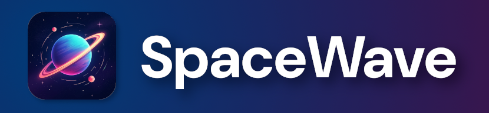

<div align="center">
  <a href="https://spacewave.app" target="_blank" rel="noopener noreferrer">
    
  </a>

  <h3>Your own cloud, built for humans and agents</h3>

  <p>
    Start with a private workspace that runs on your computers, syncs peer-to-peer, and keeps working offline.<br/>
    Grow it into shared Spaces for apps, devices, workflows, plugins, and automation.<br/>
  </p>
</div>

## Overview

**Spacewave** turns your computers into a local-first cloud you control. Start
with a private workspace, use it from the browser or desktop app, sync it
peer-to-peer, and keep working even when you are offline.

As your work grows, that workspace becomes a Space: shared encrypted state for
files, notes, apps, layouts, devices, workflows, and plugin data without putting
everything inside someone else's database.

People, apps, devices, and AI agents can all work against the same Space. That
means automation can operate on durable state you can inspect, edit, share, and
recover, instead of disappearing into a chat transcript.

Spacewave combines the convenience of cloud apps with the freedom of
open-source software. The cloud can help with accounts, relay, backup, storage,
and networking, but it does not become the owner of your work.

When you want to go deeper, Spacewave is also a full-stack for local-first apps
and plugins, built with Go, TypeScript, React, and WebAssembly - a home for your
personal operating system.

Features:

- **Spaces**: Shared local-first state for files, apps, devices, and workflows
- **Peer-to-Peer Sync**: Work offline and sync directly when peers are available
- **Human and Agent Ready**: Give people, plugins, and AI agents the same durable state
- **Open-Source Full Stack**: Build apps and plugins with Go, TypeScript, React, and WebAssembly
- **Pluggable Storage**: Store data in local, browser, cloud, or self-hosted backends
- **End-to-End Encrypted**: Keep storage, sync, and collaboration private by default

**Plugin Ecosystem**: Extend workspaces with community plugins:

  - File, database, code, and document collaboration
  - Chat, communications, forums, and messaging
  - Remote command and control of your devices
  - [SkiffOS] for running and managing Linux hosts
  - ...and more!

[Spacewave App]: https://spacewave.app
[SkiffOS]: https://skiffos.com

## Getting Started

Where would you like to start?

- I want to use or self-host Spacewave: [Open Spacewave to get started]!
- I want to modify Spacewave or build my own plugins: see [running from source](#-running-from-source)
- I want to develop my own app with Spacewave Stack: see [Bldr]

[Open Spacewave to get started]: https://spacewave.app
[Bldr]: ./bldr

You can try Spacewave instantly in your web browser, just [click here].

[click here]: https://spacewave.app

## Running from source

To start the Spacewave app:

```bash
# Install dependencies
bun install

# Start the desktop app
bun run start:desktop

# Start the web app
bun run start:web

# Start the WASM web app
bun run start:web:wasm
```

To run the test suite:

```bash
# All tests
bun run test

# Go tests only
bun run test:go

# Lint
bun run lint

# Typecheck
bun run typecheck
```

Spacewave uses [Protobuf](https://protobuf.dev/) for message encoding.

You should re-generate the protobufs after changing any `.proto` file:

```bash
# generate the protobufs
bun run gen
```

## Why Spacewave?

Traditional web-apps store and process data on servers and cloud infrastructure.
Developers write API calls to access the user data, and the frontend just
displays the response. Recent trends towards server-side rendering have
increased dependence on servers and the cloud even more.

This works great for static websites and services that require an internet
connection. But what if we want apps that work offline, are open-source, or use
features traditionally expensive to scale like multiplayer sync?

Imagine if every video game you played was rendered fully server-side. That game
would be way too laggy to play smoothly, right? This is how our modern web apps
are designed and built. But it doesn't have to be this way.

Modern web browsers come with WebAssembly, WebWorkers, ServiceWorkers,
SharedWorkers, IndexedDB, and WebRTC. These features enable building **fully
self-sufficient** apps running fully on the client side.

Spacewave utilizes these features to provide resources to apps with an
abstraction layer smoothing the differences between platforms. For example, an
app can allocate a SQL database and store it in Redis, BadgerDB, or IndexedDB,
all without changing a single line of code when switching backends.

We look forward to building a new generation of apps that are both open-source
and cloud-enabled, without requiring users to jump through hoops to self-host
and manage their own servers.

## Architecture

The goal is to build software that runs anywhere with any storage backend.

Spacewave runs the app logic in WebWorkers/SharedWorkers in the web browser and
as native processes on desktop. This brings the entire Go ecosystem to the
browser while enabling true [local-first] apps.

[local-first]: https://www.inkandswitch.com/local-first/

Components:

- **[Bifrost]** - Network over any transport
  - Cross-platform peer-to-peer communication
  - Encrypted transport protocols with stream multiplexing
  - Supports WebRTC and WebSocket in the web browser

- **[Hydra]** - Store data anywhere w/ p2p sync
  - Many supported data structures: SQL, K/V, GraphDB, ...
  - Pluggable storage backends: BadgerDB, Redis, S3, ...
  - Supports IndexedDB in the web browser

- **[Bldr]** - Build and run on any OS or browser
  - Build system and development environment
  - Hot reload and fast JS bundling with [esbuild] and [vite]
  - Cross-platform build and release

- **[SkiffOS]** - Build and run on any device (w/ Linux)
  - Supports 40+ device types
  - Cross-compiles to target any architecture
  - Minimal with modular configuration

- **[Forge]** - Continuous integration and automation
  - Distributed job scheduler
  - CI/CD pipeline automation
  - Workflow orchestration

- **[Auth]** - Authentication methods and credential flows
  - Password and PEM-based authentication primitives
  - Shared auth building blocks for provider and session flows

- **[Identity]** - Identity and domain primitives
  - Identity records and domain-backed configuration
  - Supporting types for account and provider workflows

[Bldr]: ./bldr
[Bifrost]: ./net
[Hydra]: ./db
[Forge]: ./forge
[Auth]: ./auth
[Identity]: ./identity
[SkiffOS]: https://github.com/skiffos/skiffos
[esbuild]: https://esbuild.github.io/
[vite]: https://vite.dev

All components are designed to be used in multiple ways:

- As an application: each component has its own CLI
- As a library: all Go packages are documented as libraries
- As part of Spacewave: controller configuration with YAML/JSON

Spacewave can be extended with custom plugins or modifications to the client,
and custom apps can use the libraries to directly access the data stored in your
workspaces.

The current repository is a monorepo. The root app layer sits alongside the
component directories:

- `net/` - Bifrost
- `db/` - Hydra
- `bldr/` - Bldr
- `forge/` - Forge
- `auth/` - Auth
- `identity/` - Identity
- `app/`, `core/`, `sdk/`, `web/`, `cmd/` - the Spacewave application layer

## Space: The Final Frontier

Let's take a moment to look far into the future. We're sending the first people
to Mars. What OS are they using on their laptops and phones? What apps are they
using to share files, collaborate, and communicate?

The latency of a one-way message from Mars to Earth varies between 2 to 24
minutes. HTTPs does not work with this much latency, and even begins to break
with round-trip times over one second, let alone two minutes. Our existing
internet apps would not work in this environment.

Spacewave solves this problem with a local-first p2p architecture. Regardless of
internet latency or equipment failure, users can access their workspaces and
apps, without the need for cloud, servers, or on-call engineers.

Peer-to-peer networking works even when the internet doesn't.

## License

Spacewave is licensed under the permissive Apache-2.0 license.

All dependencies are [verified] to be equally permissive, one of:

- 0BSD
- Apache-2.0
- Apache-2.0 OR MIT
- BSD-2-Clause
- BSD-3-Clause
- CC0-1.0
- ISC
- MIT
- MPL-2.0

All of these licenses support commercial use, modification, and redistribution with attribution.

[verified]: https://github.com/s4wave/spacewave/actions/runs/24951306003/job/73061745956#step:8:1

## Support and Community

Spacewave is a community project to build the **most powerful** collaborative
workspace and **self-hosting** tool.

We welcome contributions in the form of GitHub issues and pull requests.

Please open a [GitHub issue] with any questions / issues / suggestions.

[GitHub issue]: https://github.com/s4wave/spacewave/issues/new

... or feel free to reach out via [Email] or [Discord]!

[Email]: mailto:oss@spacewave.app
[Discord]: https://discord.gg/KJutMESRsT
